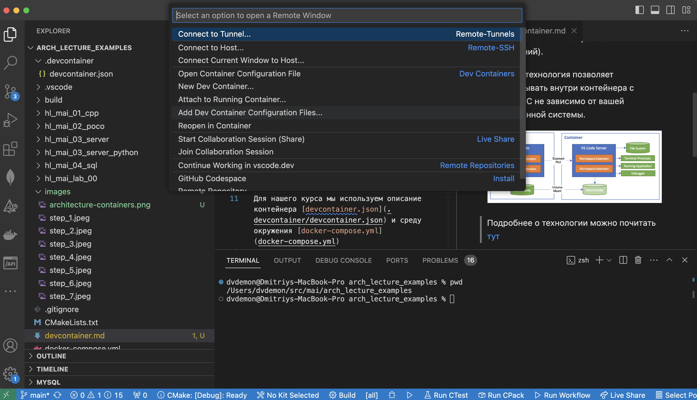

# Настройка Devcontainer

Devcontainer - это технология, которая позволяет создавать рабочие пространства в IDE с помощью технологии Docker.  Это очень удобная технология, поскольку она позволяет соединить настройки окружения (описанного в  docker-compose.yml) и  IDE Visual studio Code (установка и настройка расширений).

Таже эта технология позволяет разрабатывать внутри контейнера с нужной ОС не зависимо от вашей операционной системы.

Подробнее о технологии можно почитать [тут](https://code.visualstudio.com/docs/devcontainers/containers)

Для нашего курса мы используем описание контейнера [devcontainer.json](.devcontainer/devcontainer.json) и среду окружения [docker-compose.yml](docker-compose.yml)

При открытии директории у которой есть конфигурация в папке ".devcontainer" Visual Studio Code предлагает его открыть "в контейнере", что и нужно сделать.

Так же, открыть его можно кликнув на зеленый квадрат в левом нижнем углу и выбрав пункт открытия контейнера:

Для работы понадобится установка расширения [Remote Development](https://marketplace.visualstudio.com/items?itemName=ms-vscode-remote.vscode-remote-extensionpack) на вашу основную машину.