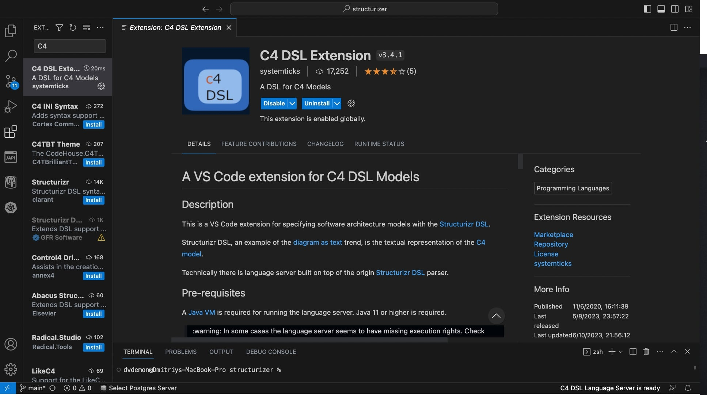

## Инструменты для проектирования технического решения

* В качестве нотации для моделирования диаграмм применяется модель [C4](https://c4model.com/)
* В качестве среды генерации диаграмм и документации применяется [Struzturizr Lite](https://structurizr.com/)
* В качестве рекомендуемого средства для редактирования  диаграмм и документации используем [Visual Studio Code](https://code.visualstudio.com/)
* В качестве среды для запуска Structurizr будет использоваться среда контейнеризации приложений Docker/Podman и/или встроенный плагин в Visual Studio Code
* В качестве языка разметки для создания технической документации используется [MarkDown](https://www.markdownguide.org/basic-syntax/)

### Установка и настройка Visual Studio Code

1. Скачиваем c [https://code.visualstudio.com/download](https://code.visualstudio.com/download) установочный пакет и устанавливаем его на машине с которой будем редактировать модели

2. Открываем панель работы с расширениями и находим расширение [C4 DSL Extension](https://marketplace.visualstudio.com/items?itemName=systemticks.c4-dsl-extension)

3. Устанавливаем C4 DSL Extension
4. Настраиваем C4 DSL Extension (должны быть включены следующие галочки):

5. Проверяем работу расширения, для этого делаем простой файл **workspace.dsl** и открываем его в Visual Studio Code
```dsl
workspace {
    name "Пример"
    model {
        myUser   =  person "Пользователь"
        mySystem =  softwareSystem "Моя система" 
        otherSystem =  softwareSystem "Чужая система" 
        myUser   -> mySystem "Работает в системе"
        mySystem -> otherSystem "Запрашивает полезные данные" "HTTP\443"
    }
    views {
         systemContext  mySystem {
            include *
            autoLayout 
         }
        themes default
    }
}
```
6. После установки плагина preview диаграм будет доступно по ссылке "Show as structurizr diagram"

7. Для того что бы плагин мог показывать Preview нужно что бы на машине была Java 17 или выше. Что бы узнать версию java наберите в командной строке:
```sh
java -version
```
8. Если у вас версия java меньше 17, тогда обновите версию Java [например отсюда](https://axiomjdk.ru/pages/downloads/).
9. Находим и устанавливаем расширение Mark Down All In One

10.  Находим и устанавливаем расширение для работы с PlantUML
 (в курсе это не обязательно - но в жизни, точно пригодится)
1.  В качестве начального проекта можно использовать шаблон который хранится в **hl_mai_lab_00**

### Настройка Structurizr Lite

Для работы только с диаграммами в Structurizr DSL нам достаточно иметь установленный плагин (описано выше). Однако, для полноценной работы с документацией и ADR нам так понадобится полноценный Structurizr Lite. Его рекомендуется запускать в Docker контейнере. 

В директории в которой расположен **workspace.dsl** Создаем **docker-compose.yml**:

```yml
version: '3.3'
services:
  structurizr:
    image: structurizr/lite:latest
    container_name: structurizr_lite_model
    ports:
      - 8080:8080
    volumes:
        - .:/usr/local/structurizr
```
Запускаем:

```sh
docker-compose up -d
```

После запуска Structurizr будет доступен в веб-браузере по адресу: **http://localhost:8080**


### Полезные ссылки по использованию Structurizr

* [Help по Structurizr](https://structurizr.com/help/)
* [Описание языка DSL](https://docs.structurizr.com/dsl/language)
* [Руководство по PlantUML](https://plantuml.com/guide)
* [PlantUML CookBook](https://crashedmind.github.io/PlantUMLHitchhikersGuide/)